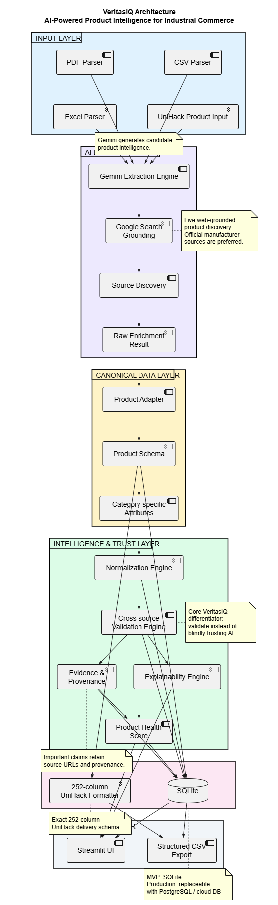

# VeritasIQ

<p align="center">
  <h1 align="center">VeritasIQ</h1>
  <p align="center">
    <strong>AI-powered Product Intelligence Platform for Industrial Commerce</strong>
  </p>
  <p align="center">
    Transforming fragmented product information into structured,
    validated, evidence-backed product intelligence.
  </p>
</p>

<p align="center">

**AI Extraction** • **Source Discovery** • **Validation** • **Evidence** • **Explainability** • **Health Scoring**

</p>

---

## The Core Idea

> **AI proposes product intelligence. VeritasIQ validates it against external
> sources instead of blindly trusting the model.**

Industrial product information is often fragmented across PDFs, spreadsheets,
supplier listings, manufacturer pages, and other sources.

A conventional AI extraction system can produce a clean-looking answer while
still containing incorrect product information.

VeritasIQ separates:

| Layer | Purpose |
|---|---|
| **Extraction** | What the source appears to say |
| **Normalization** | Convert values into a consistent representation |
| **Validation** | Compare information across sources |
| **Evidence** | Retain supporting source URLs |
| **Explainability** | Show why information is reliable or conflicting |
| **Health Scoring** | Summarize product data quality |

This makes VeritasIQ focused on **trustworthy product intelligence**, rather
than extraction alone.

---

# What VeritasIQ Does

## Multi-source Ingestion

VeritasIQ supports product information from:

- PDF
- CSV
- Excel
- UniHack structured product input

---

## AI-powered Extraction

Google Gemini extracts candidate product information while following strict
extraction rules:

- Do not invent unsupported information
- Preserve source meaning
- Keep brand and manufacturer separate
- Keep product type, category, and subcategory separate
- Preserve original values before normalization
- Store category-specific information separately

The AI extraction layer is intentionally separated from the validation layer.

---

## Web-grounded Product Enrichment

The UniHack enrichment pipeline can use Gemini with Google Search grounding
to identify product information from external sources.

The enrichment workflow can:

- Resolve product identity
- Identify manufacturer information
- Identify manufacturer part numbers
- Discover official manufacturer sources
- Discover supporting distributor sources
- Extract product attributes
- Preserve evidence URLs

Official manufacturer sources are preferred when available.

---

## Source Discovery

VeritasIQ includes a source discovery component that:

- Searches for candidate product sources
- Uses MPN and description signals
- Scores potential sources
- Gives additional weight to manufacturer sources
- Recognizes industrial distributors
- Penalizes marketplace sources
- Retrieves source content for further processing

The goal is not simply to find *a* webpage.

The goal is to identify **useful evidence for the product claim being evaluated**.

---

# Visual Overview

<p align="center">
  
</p>

<p align="center">
  <em>Modular architecture for extracting, validating, explaining, and delivering product intelligence.</em>
</p>

---

# How VeritasIQ Works

<p align="center">
  
</p>

The pipeline follows a deliberate sequence:

| Stage | Purpose |
|---|---|
| **01 — Ingest** | Accept product information from multiple source formats |
| **02 — Extract** | Use AI to identify candidate product information |
| **03 — Discover** | Find relevant external product sources |
| **04 — Normalize** | Convert comparable values into consistent representations |
| **05 — Validate** | Compare information across sources |
| **06 — Evidence** | Preserve supporting source URLs |
| **07 — Explain** | Explain agreements and conflicts |
| **08 — Score** | Calculate product data health |
| **09 — Deliver** | Produce structured, commerce-ready output |

---

# The Trust Layer

The most important architectural distinction in VeritasIQ is the separation
between **AI extraction** and **cross-source validation**.

```text
                         PRODUCT SOURCE
                               │
                               ▼
                    ┌─────────────────────┐
                    │  Gemini Extraction  │
                    │                     │
                    │ "What does the      │
                    │  source appear      │
                    │  to say?"           │
                    └──────────┬──────────┘
                               │
                               ▼
                    ┌─────────────────────┐
                    │ Canonical Product   │
                    │      Schema         │
                    └──────────┬──────────┘
                               │
                 ┌─────────────┴─────────────┐
                 ▼                           ▼
       ┌─────────────────┐         ┌─────────────────┐
       │ Source Discovery│         │  Normalization  │
       └────────┬────────┘         └────────┬────────┘
                │                           │
                └─────────────┬─────────────┘
                              ▼
                   ┌─────────────────────┐
                   │ Cross-source        │
                   │ Validation          │
                   └──────────┬──────────┘
                              │
                ┌─────────────┼─────────────┐
                ▼             ▼             ▼
           Evidence      Explainability   Health
           & Provenance                   Score
                │             │             │
                └─────────────┼─────────────┘
                              ▼
                   ┌─────────────────────┐
                   │ Trusted Structured  │
                   │ Product Data        │
                   └─────────────────────┘
```

---

The validation layer determines whether information is:

- Supported by available sources
- Consistent across sources
- Conflicting across sources
- Incomplete
- Backed by evidence

This is the core trust mechanism of the platform.

---

# Canonical Product Model

Extracted information is converted into a common `Product` representation.

The canonical model supports:

- Product identity
- Brand
- Manufacturer
- Model / product numbers
- Product type
- Category
- Subcategory
- Dimensions
- Weight
- Material
- Color
- Size
- Price
- Warranty
- Certifications
- Included items
- Category-specific attributes
- Product content
- Evidence
- Product images
- Specification sheets

This provides a consistent representation before downstream processing.

---

# Normalization & Validation

## Normalization

Product values can be normalized before comparison so that equivalent
representations can be evaluated consistently.

Weight normalization is currently supported as part of the validation pipeline.

## Cross-source Validation

VeritasIQ compares product information from multiple sources.

The validation layer can identify:

- Agreement
- Conflicting values
- Missing values
- Source-level evidence

The system does **not** simply overwrite conflicting information.

Conflicts can be preserved and explained.

---

# Evidence & Explainability

Validation results retain source information so that product claims can be
traced back to supporting evidence.

Users can understand:

- Which sources support a value
- Whether sources agree
- Where conflicts exist
- Why a validation result was produced

This turns a product value from:

```text
"AI says this is correct."

into:

> **"This value is supported by these sources, these sources agree,
> and this is why VeritasIQ considers it reliable."**
```

---

# Use Cases

<p align="center">
  
</p>

VeritasIQ is designed around the workflow of a product/catalogue manager:

- Upload product information
- Extract product information
- Normalize attributes
- Compare multiple sources
- Detect conflicts
- Review evidence
- Review product health
- Export structured product data

---

# Technology Stack

| Layer | Technology |
|---|---|
| **Language** | Python |
| **UI** | Streamlit |
| **AI** | Google Gemini |
| **Search Grounding** | Google Search |
| **Data Validation** | Pydantic |
| **Data Processing** | Pandas |
| **PDF Processing** | pdfplumber |
| **Excel Processing** | OpenPyXL |
| **HTTP Retrieval** | Requests |
| **Testing** | Pytest |
| **Development Diagrams** | PlantUML |

---

# Repository Documentation

## Architecture

[View Architecture Diagram](docs/diagrams/architecture.png)

## Process Flow

[View Process Flow Diagram](docs/diagrams/process_flow.png)

## Use Cases

[View Use-Case Diagram](docs/diagrams/use_case.png)

Editable PlantUML source files are also included in
`docs/diagrams/`.

---

# Project Status

## Implemented

- [x] PDF ingestion
- [x] CSV ingestion
- [x] Excel ingestion
- [x] AI product extraction
- [x] Canonical product schema
- [x] Product normalization
- [x] Multi-source validation
- [x] Validation explainability
- [x] Evidence / provenance
- [x] Product Health Score
- [x] Web source discovery
- [x] Gemini-powered UniHack enrichment
- [x] Fixture-based enrichment
- [x] UniHack product adapter
- [x] 252-column delivery validation
- [x] Delivery CSV generation
- [x] Automated tests
- [x] Architecture documentation

## In Progress

- [ ] End-to-end production deployment
- [ ] Final UI refinement
- [ ] Full end-to-end demo workflow
- [ ] Final hackathon presentation

## Future

- [ ] PostgreSQL / cloud persistence
- [ ] Production-scale retrieval
- [ ] Authentication
- [ ] Expanded category-specific validation
- [ ] Production monitoring

---

# Project Philosophy

```text
Extract → Normalize → Validate → Explain → Trust
```